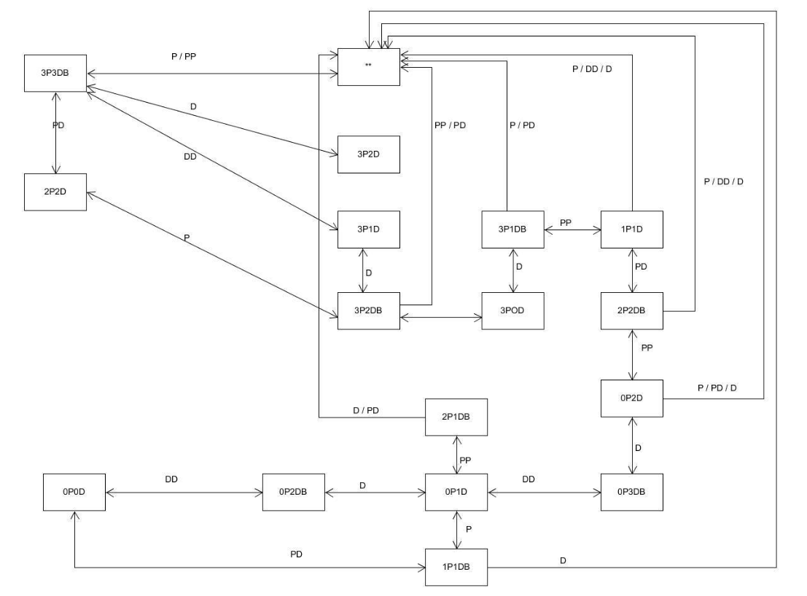

# 3D游戏编程与设计

## HW 10

### P&D 过河游戏智能帮助实现

- 实现状态图的自动生成
- 讲解图数据在程序中的表示方法
- 利用算法实现下一步的计算

### 演示视频
  


### 状态图与图数据

状态图可通过枚举列出  
| 左岸恶魔| 左岸牧师| 右岸恶魔| 右岸牧师| 船只|
|:-:|:-:|:-:|:-:|:-:|
| 0| 0| 3| 3| 右岸|
| 1| 1| 2| 2| 左岸|
| 3| 3| 0| 0| 左岸|
| 2| 2| 1| 1| 右岸|
|...|...|...|...|...|  

枚举出所有状态然后化为状态转换图如下  
   

有了上面的状态转换图, 就只需要实现相应的代码, 这里将以前的代码重新改写一下, 将一个状态改写为一个具体的class, 其中包括两岸的恶魔与牧师数量, 船的数量, 父节点等, 加入父节点是为了构建具体的图. 接下来我们需要根据状态实现BFS, 根据相应的游戏规则可知搜索的情况包括以下几种, 包括船只的位置, 船只上的空闲位置, 伪代码如下  
```
初始化队列Q;
访问顶点v; visited [v]=1; 顶点v入队Q;
while (队列Q非空) 
    v=队列Q的队头元素出队;
    w=顶点v的第一个邻接点;
    while (w存在) 
        如果w 未被访问，则
        访问顶点w; 
        visited[w]=true; 顶点w入队列Q；
        w=顶点v的下一个邻接点；
```  
参考师兄博客实现实际的BFS算法如下  
```c#
public static PristsAndDevilsState BFS(PristsAndDevilsState start, PristsAndDevilsState end)
{
    Queue<PristsAndDevilsState> found = new Queue<PristsAndDevilsState>();
    PristsAndDevilsState temp = new PristsAndDevilsState(start.leftPriests, start.leftDevils, start.rightPriests, start.rightDevils, start.boat_pos, null);
    found.Enqueue(temp);
    while (found.Count > 0){
        temp = found.Peek();
        if (temp == end){
            while (temp.parent_state != start){
                temp = temp.parent_state;
            }
            return temp;
        }
        found.Dequeue();

        if (temp.boat_pos){
            if (temp.leftPriests > 0){
                PristsAndDevilsState next = new PristsAndDevilsState(temp);
                next.parent_state = new PristsAndDevilsState(temp);
                next.boat_pos = false;
                next.leftPriests--;
                next.rightPriests++;
                if (next.isValid() && !found.Contains(next)){
                    found.Enqueue(next);
                }
            }if (temp.leftDevils > 0){
                PristsAndDevilsState next = new PristsAndDevilsState(temp);
                next.parent_state = new PristsAndDevilsState(temp);
                next.boat_pos = false;
                next.leftDevils--;
                next.rightDevils++;
                if (next.isValid() && !found.Contains(next)){
                    found.Enqueue(next);
                }
            }if (temp.leftDevils > 0 && temp.leftPriests > 0){
                PristsAndDevilsState next = new PristsAndDevilsState(temp);
                next.parent_state = new PristsAndDevilsState(temp);
                next.boat_pos = false;
                next.leftDevils--;
                next.rightDevils++;
                next.leftPriests--;
                next.rightPriests++;
                if (next.isValid() && !found.Contains(next)){
                    found.Enqueue(next);
                }
            }if (temp.leftPriests > 1){
                PristsAndDevilsState next = new PristsAndDevilsState(temp);
                next.parent_state = new PristsAndDevilsState(temp);
                next.boat_pos = false;
                next.leftPriests -= 2;
                next.rightPriests += 2;
                if (next.isValid() && !found.Contains(next)){
                    found.Enqueue(next);
                }
            }if (temp.leftDevils > 1){
                PristsAndDevilsState next = new PristsAndDevilsState(temp);
                next.parent_state = new PristsAndDevilsState(temp);
                next.boat_pos = false;
                next.leftDevils -= 2;
                next.rightDevils += 2;
                if (next.isValid() && !found.Contains(next)){
                    found.Enqueue(next);
                }
            }
        }else{
            if (temp.rightPriests > 0){
                PristsAndDevilsState next = new PristsAndDevilsState(temp);
                next.parent_state = new PristsAndDevilsState(temp);
                next.boat_pos = true;
                next.rightPriests--;
                next.leftPriests++;
                if (next.isValid() && !found.Contains(next)){
                    found.Enqueue(next);
                }
            }if (temp.rightDevils > 0){
                PristsAndDevilsState next = new PristsAndDevilsState(temp);
                next.parent_state = new PristsAndDevilsState(temp);
                next.boat_pos = true;
                next.rightDevils--;
                next.leftDevils++;
                if (next.isValid() && !found.Contains(next)){
                    found.Enqueue(next);
                }
            }if (temp.rightDevils > 0 && temp.rightPriests > 0){
                PristsAndDevilsState next = new PristsAndDevilsState(temp);
                next.parent_state = new PristsAndDevilsState(temp);
                next.boat_pos = true;
                next.rightDevils--;
                next.leftDevils++;
                next.rightPriests--;
                next.leftPriests++;
                if (next.isValid() && !found.Contains(next)){
                    found.Enqueue(next);
                }
            }if (temp.rightDevils > 1) {
                PristsAndDevilsState next = new PristsAndDevilsState(temp);
                next.parent_state = new PristsAndDevilsState(temp);
                next.boat_pos = true;
                next.rightDevils -= 2;
                next.leftDevils += 2;
                if (next.isValid() && !found.Contains(next)){
                    found.Enqueue(next);
                }
            }if (temp.rightPriests > 1){
                PristsAndDevilsState next = new PristsAndDevilsState(temp);
                next.parent_state = new PristsAndDevilsState(temp);
                next.boat_pos = true;
                next.rightPriests -= 2;
                next.leftPriests += 2;
                if (next.isValid() && !found.Contains(next)){
                    found.Enqueue(next);
                }
            }
        }
    }
    return null;
}
```

最后只需要实现UI部分即可.  
```c#
void initializePD() {
    for (int i = 0; i < 3; ++i) {
        vec[i].x = begin_len + i * space;
        vec[i].y = 1;
        vec[i].z = 0;
    }
    for (int i = 3; i < 6; ++i) {
        vec[i].x = begin_len + 2 * space + (i - 2) * space;
        vec[i].y = 1;
        vec[i].z = 0;
    }
    for (int i = 0; i < 3; ++i) {
        priests[i] = GameObject.Instantiate(Resources.Load("Prefabs/Priest", typeof(GameObject)), vec[i], Quaternion.identity, null) as GameObject;
        priests[i].name = "priest" + i.ToString();
        priests[i].AddComponent<SSActionManager>();
        devils[i] = GameObject.Instantiate(Resources.Load("Prefabs/Devil", typeof(GameObject)), vec[i + 3], Quaternion.identity, null) as GameObject;
        devils[i].name = "devils" + i.ToString();
        devils[i].AddComponent<SSActionManager>();
    }
}

void OnGUI() {
    if(GUI.Button(new Rect(Screen.width / 2 - 50, Screen.height / 2 + 200, 100, 100), "Go!")) {
        if (BoatController.count >= 1) {
            BoatController.if_move = true;
            run = false;
            int count = BoatController.boat.transform.childCount;
            if (BoatController.direction_left) {
                for (int i = 0; i < count; ++i) {
                    Click.decCount(BoatController.boat.transform.GetChild(i).name, 0);
                    Click.insCount(BoatController.boat.transform.GetChild(i).name, 1);
                }
            } else {
                for (int i = 0; i < count; ++i) {
                    Click.decCount(BoatController.boat.transform.GetChild(i).name, 1);
                    Click.insCount(BoatController.boat.transform.GetChild(i).name, 0);
                }
            }
            ++step;
        }
    }

    // success or lose or normal condition
    if (Judge.judgeEnd() == 2 || Judge.judgeEnd() == 1) { // lose
        GUI.Label(new Rect(Screen.width / 2 - 100, Screen.height / 2 - 200, 200, 200), "Failed, reload after 2s", mstyle);
        Invoke("reset", Time.time + 2);
    } else if (Judge.judgeEnd() == 0) { // success
        GUI.Label(new Rect(Screen.width / 2 - 100, Screen.height / 2 - 200, 200, 200), "Success! reload after 2s", mstyle);
        Invoke("reset", Time.time + 2);
    }
}
```
